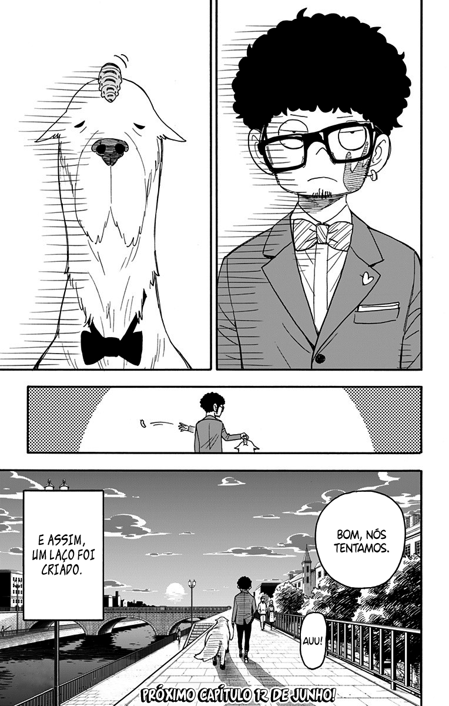

# 0062-4
##### [ANTERIOR](/spy-family/0062-3/)&nbsp;&nbsp;&nbsp;&nbsp;&nbsp;&nbsp;[MENU](/spy-family/)&nbsp;&nbsp;&nbsp;&nbsp;&nbsp;&nbsp;[PRÓXIMO](/spy-family/0063/)

##### [ANTERIOR](/spy-family/0062-3/)&nbsp;&nbsp;&nbsp;&nbsp;&nbsp;&nbsp;[MENU](/spy-family/)&nbsp;&nbsp;&nbsp;&nbsp;&nbsp;&nbsp;[PRÓXIMO](/spy-family/0063/)
