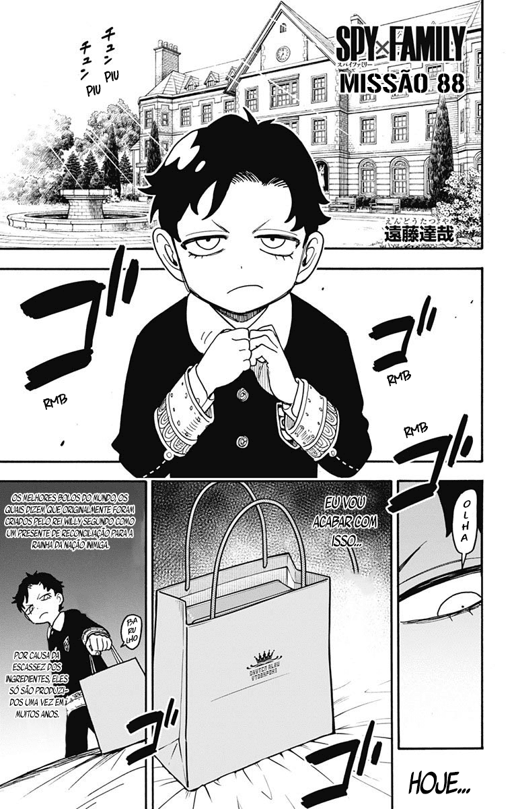

# 0088
##### [ANTERIOR](/spy-family/0087/)&nbsp;&nbsp;&nbsp;&nbsp;&nbsp;&nbsp;[MENU](/spy-family/)&nbsp;&nbsp;&nbsp;&nbsp;&nbsp;&nbsp;[PRÓXIMO](/spy-family/0089/)

##### [ANTERIOR](/spy-family/0087/)&nbsp;&nbsp;&nbsp;&nbsp;&nbsp;&nbsp;[MENU](/spy-family/)&nbsp;&nbsp;&nbsp;&nbsp;&nbsp;&nbsp;[PRÓXIMO](/spy-family/0089/)
