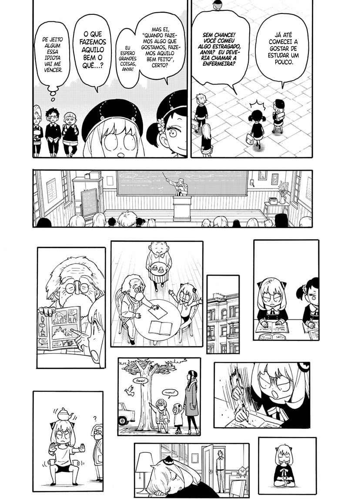

# 0092
##### [ANTERIOR](/spy-family/0091/)&nbsp;&nbsp;&nbsp;&nbsp;&nbsp;&nbsp;[MENU](/spy-family/)&nbsp;&nbsp;&nbsp;&nbsp;&nbsp;&nbsp;[PRÓXIMO](/spy-family/0093/)

##### [ANTERIOR](/spy-family/0091/)&nbsp;&nbsp;&nbsp;&nbsp;&nbsp;&nbsp;[MENU](/spy-family/)&nbsp;&nbsp;&nbsp;&nbsp;&nbsp;&nbsp;[PRÓXIMO](/spy-family/0093/)
