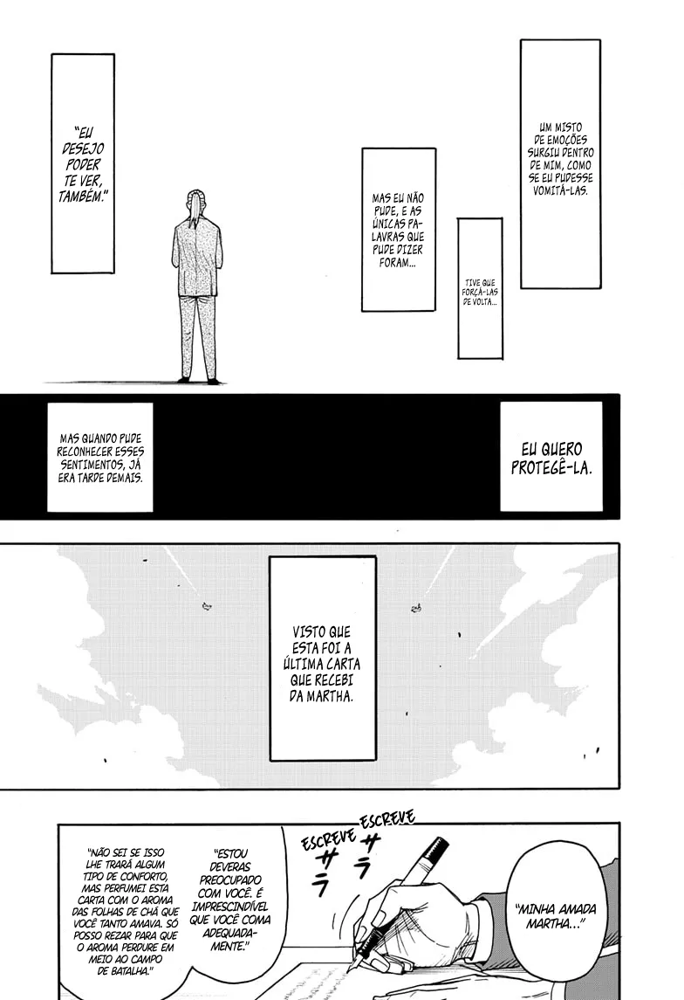
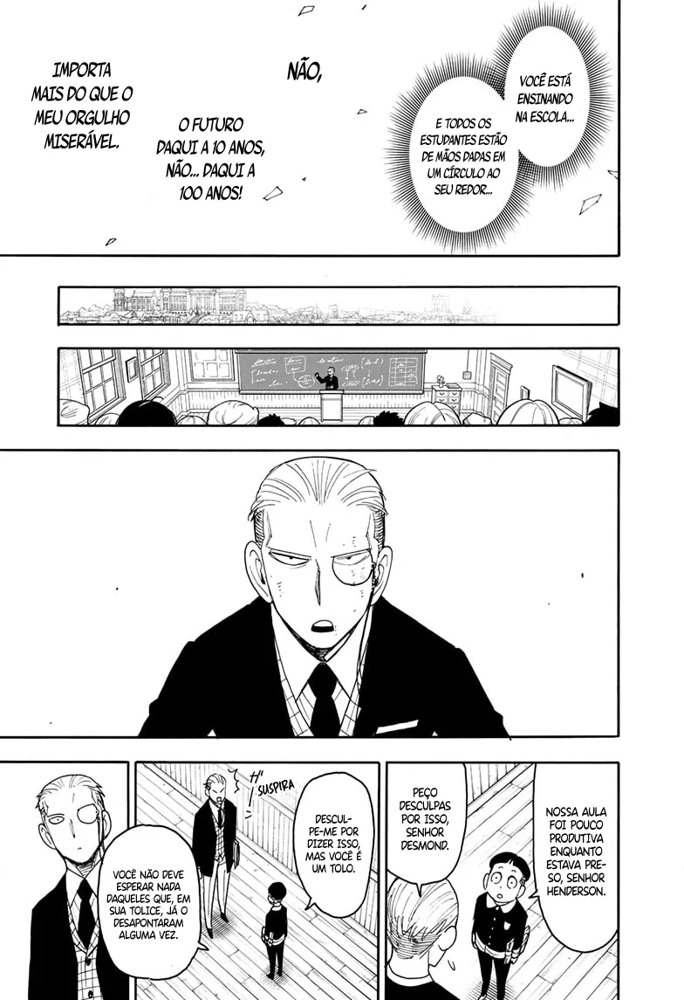

# 0099
##### [ANTERIOR](/spy-family/0098/)&nbsp;&nbsp;&nbsp;&nbsp;&nbsp;&nbsp;[MENU](/spy-family/)&nbsp;&nbsp;&nbsp;&nbsp;&nbsp;&nbsp;[PRÓXIMO](/spy-family/0100/)

##### [ANTERIOR](/spy-family/0098/)&nbsp;&nbsp;&nbsp;&nbsp;&nbsp;&nbsp;[MENU](/spy-family/)&nbsp;&nbsp;&nbsp;&nbsp;&nbsp;&nbsp;[PRÓXIMO](/spy-family/0100/)
