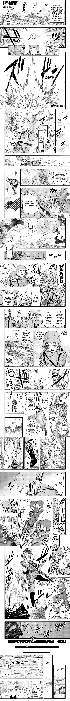
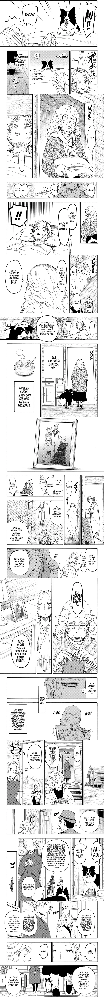
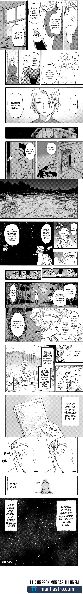

# 0100
##### [ANTERIOR](/spy-family/0099/)&nbsp;&nbsp;&nbsp;&nbsp;&nbsp;&nbsp;[MENU](/spy-family/)&nbsp;&nbsp;&nbsp;&nbsp;&nbsp;&nbsp;[PRÓXIMO](/spy-family/0101/)

##### [ANTERIOR](/spy-family/0099/)&nbsp;&nbsp;&nbsp;&nbsp;&nbsp;&nbsp;[MENU](/spy-family/)&nbsp;&nbsp;&nbsp;&nbsp;&nbsp;&nbsp;[PRÓXIMO](/spy-family/0101/)
